# News In Flight - 유저 플로우

## 1. 신규 사용자 온보딩 플로우

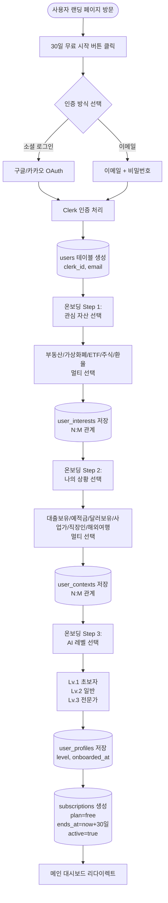

## 2. 기존 사용자 로그인 플로우

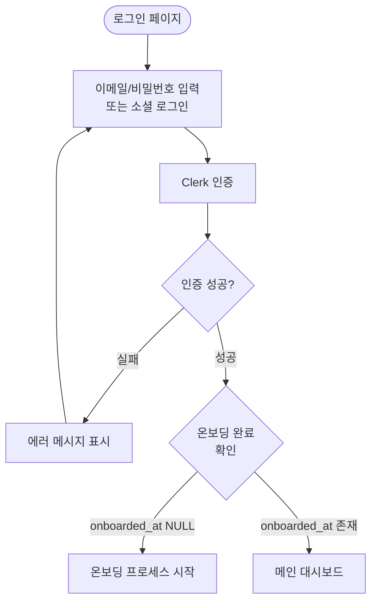

## 3. 일상 뉴스 소비 플로우

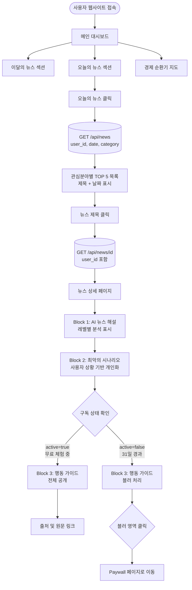

## 4. 유료 전환 플로우

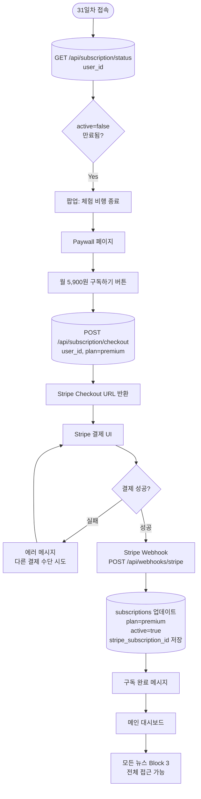

## 5. 경제 순환기 지도 플로우 (v2)

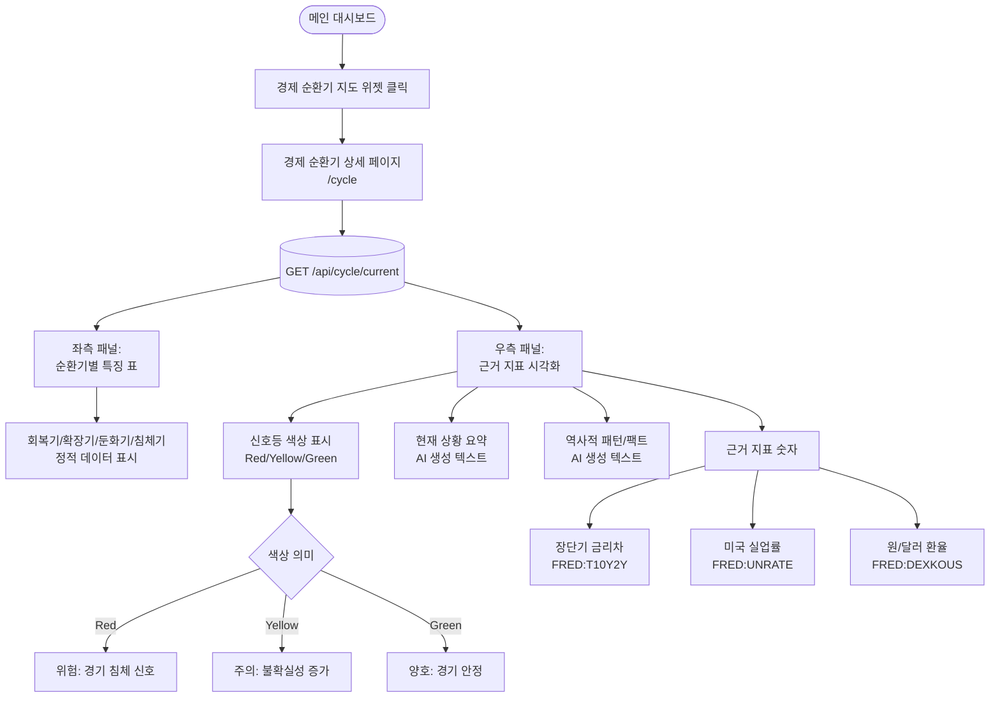

## 6. 프로필 설정 플로우

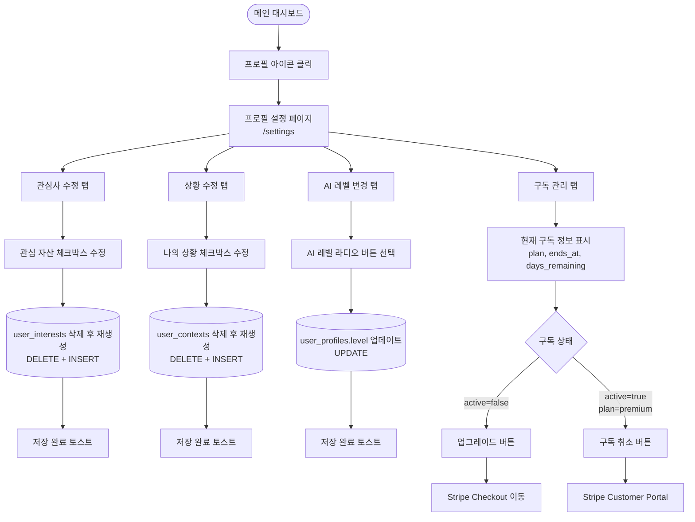

## 7. AI 뉴스 파이프라인 (백그라운드)

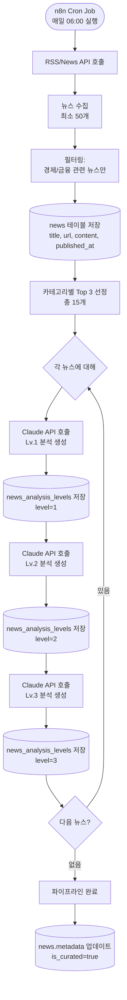

## 8. 경제 순환기 자동 업데이트 (백그라운드 - v2)

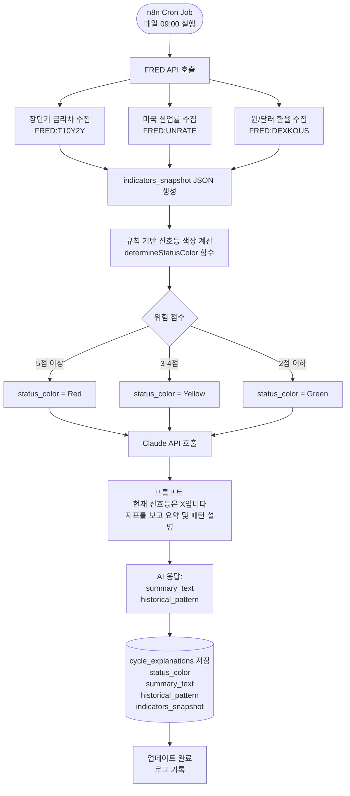

## 9. 엣지 케이스: 온보딩 중도 이탈

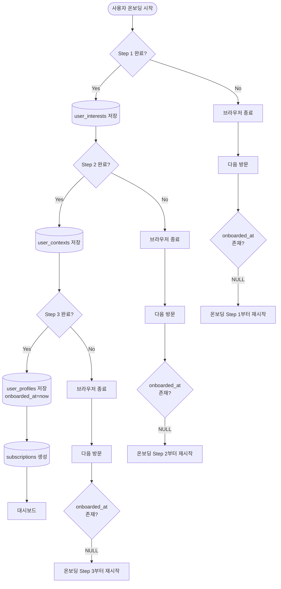

## 10. 엣지 케이스: 뉴스 분석 미완료

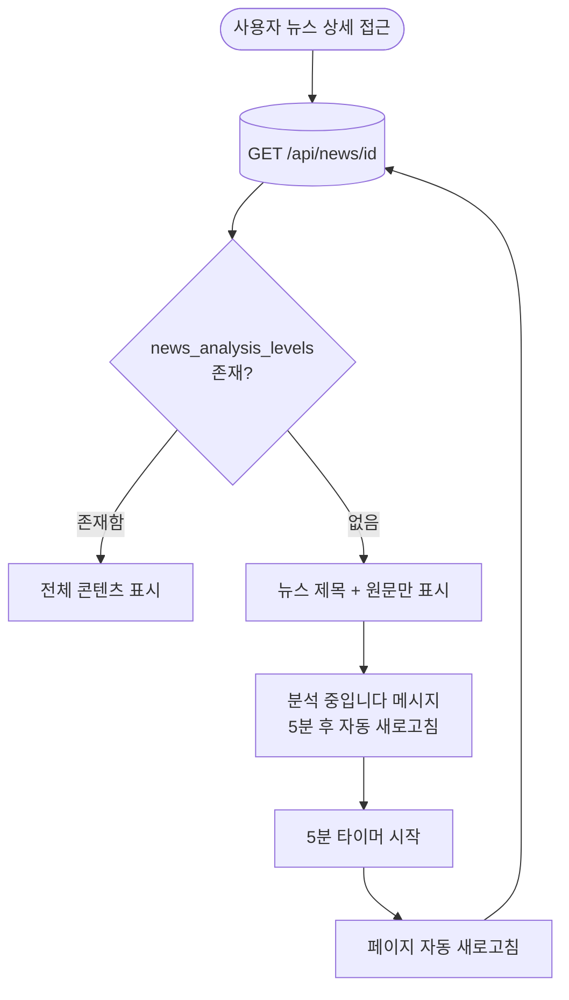

## 11. 엣지 케이스: Stripe 결제 실패

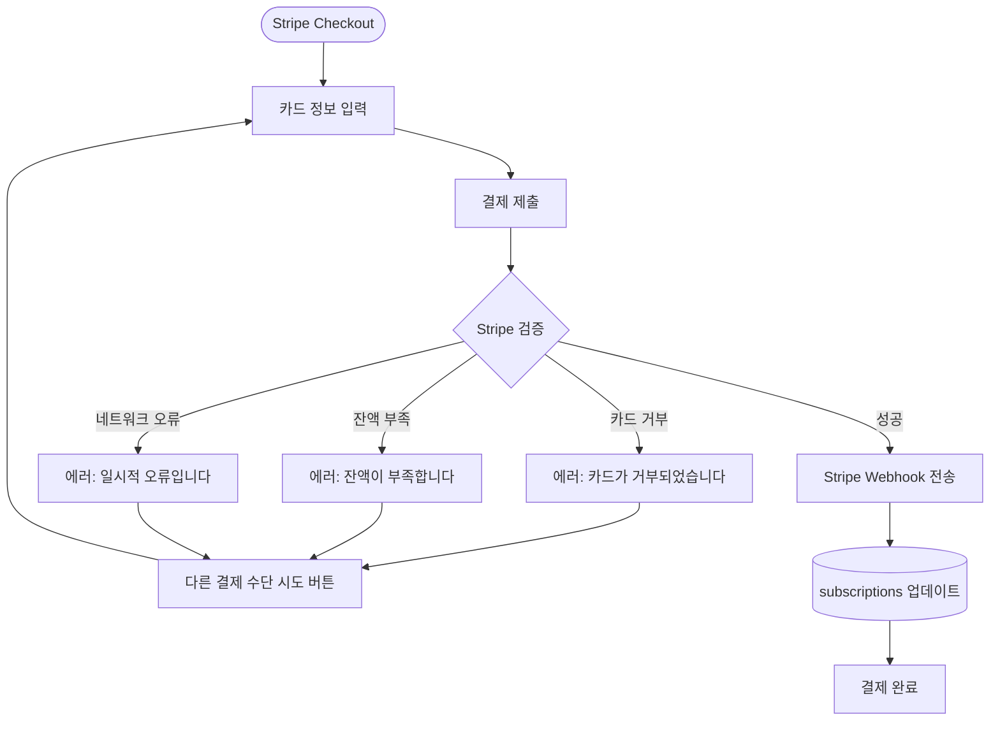

## 12. 엣지 케이스: 구독 만료 처리

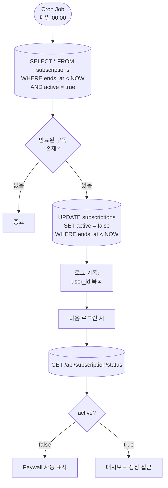

---

## 데이터베이스 상호작용 요약

### 읽기 작업 (SELECT)

- `GET /api/news`: news + news_analysis_levels JOIN
- `GET /api/news/[id]`: news + news_analysis_levels + user_profiles
- `GET /api/subscription/status`: subscriptions
- `GET /api/cycle/current`: cycle_explanations (is_latest=true)
- `GET /api/interests`: interests (is_active=true)
- `GET /api/contexts`: contexts (is_active=true)

### 쓰기 작업 (INSERT/UPDATE/DELETE)

- 온보딩 완료: INSERT user_profiles, user_interests, user_contexts, subscriptions
- 프로필 수정: UPDATE user_profiles, DELETE+INSERT user_interests/contexts
- 구독 업그레이드: UPDATE subscriptions
- AI 파이프라인: INSERT news, news_analysis_levels
- 경제 순환기 업데이트: INSERT cycle_explanations

---

## API 인증 플로우

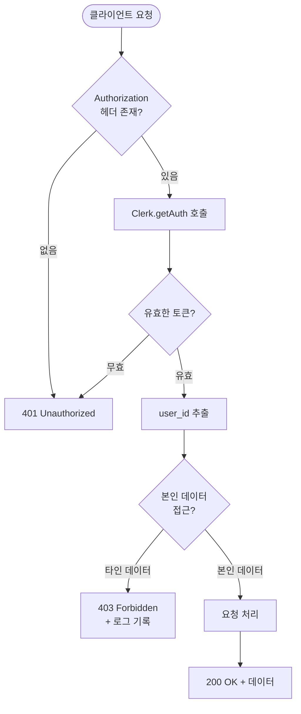
